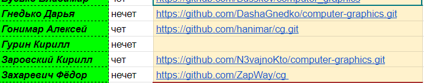

https://lenson423.github.io/kg/ - веб-приложение

# Кодревью Гурина К.

В соответствии с требования заказчика должны быть 
выполнены следующие пункты:

<ul>
<li>Написано приложение, либо веб приложение, 
иллюстрирующее работу базовых растровых алгоритмов</li>
<li>Должен быть предоставлен: exe, который должен работать
на любом ПК под
Windows XP /веб-приложение, выложенное в общий доступ;
исходный код;
сопроводительная документация</li>
</ul>

Однако по результатам кодревью были вскрыты следующие проблемы:

<ul>
<li>Отсутствует стек технологий, которые будут использоваться в проекте</li>
<li>Отсутствует описание проекта</li>
<li>Отсутствует документация для пользователя</li>
<li>Отсутствует документация для системного администратора 
и коллег</li>
<li>Отсутствует как готовое приложение</li>
</ul>

Отсутствие репозитория

## Читаемость кода
Код должен быть структурирован так, чтобы его было легко читать и понимать. Для этого важно соблюдать следующие принципы:
<ul>
<li>Соблюдать единый стиль форматирования</li>
<li>Придерживаться понятных и осмысленных названий переменных, функций и классов. Имена должны отражать их назначение и логику работы</li>
<li>Добавлять комментарии, объясняющие сложные или 
нетривиальные участки кода, а также цели и намерения, 
которые могут быть не очевидны при чтении.
Однако в данном пункте важно не переусердствовать
и не комментировать каждую строчку</li>
<li>Стремиться к простому и лаконичному коду. 
Сложные конструкции, по возможности, следует избегать</li>
</ul>

По всем этим пунктам из-за отсутствия кода балл <b>0</b>

## Архитектура приложения

Код должен соответствовать архитектурным принципам,
которые обеспечивают его поддержку, масштабируемость 
и легкость в изменении. Для этого необходимо:

<ul>
<li>Выбрать архитектуру и везде следовать ней</li>
<li>Выбрать подходящие под задачу паттерны проектирования и реализовать их</li>
<li>Грамотно разбить на модули и классы, имеющие свои зоны ответственности</li>
<li>Зарефакторить код так, чтобы можно было добавлять новые функции или изменять
существующие с минимальными изменениями в базовой структуре</li>
</ul>

По всем этим пунктам из-за отсутствия кода балл <b>0</b>

## Производительность

Код должен быть написан с учетом эффективности использования
ресурсов и возможности масштабирования.
Для достижения этого необходимо:

<ul>
<li>Минимизировать потребление памяти и процессорного времени,
избегать избыточного выделения ресурсов и освобождать
их по завершении работы</li>
<li>Проектировать код с учетом его работы на больших 
объемах данных или при высокой нагрузке,
например, избегая узких мест и используя 
параллельные процессы</li>
<li>Выбирать алгоритмы и структуры данных, 
которые соответствуют поставленной задаче и
минимизируют время выполнения</li>
<li>Уменьшить обращения к файловой системе или базе данных,
используя, к примеру, кэширование</li>
</ul>

По всем этим пунктам из-за отсутствия исполняемого приложения балл <b>0</b>

## Безопасность приложения
Код должен быть написан с учетом защиты от уязвимостей и угроз безопасности. Для этого следует:

<ul>
<li>Использовать инструменты для автоматического сканирования
уязвимостей в коде и зависимостях, 
чтобы своевременно выявлять возможные риски</li>
<li>Соблюдать стандарты безопасного кодирования, 
такие как валидация ввода,
защита от SQL-инъекций, XSS, CSRF 
и других типичных уязвимостей</li>
<li>Защищать конфиденциальные данные, применяя шифрование
как в состоянии хранения, так и при передаче, 
чтобы предотвратить несанкционированный доступ</li>
<li>Ограничивать доступ к функциям и данным 
в зависимости от прав пользователя, используя 
аутентификацию и авторизацию</li>
</ul>

По всем этим пунктам из-за отсутствия 
исполняемого приложения балл <b>0</b>

## Тестирование

Код должен быть тщательно протестирован,
чтобы поддерживать его целостность и избежать регрессий. 
Для этого необходимо:

<ul>
<li>Обеспечить покрытие ключевых модулей юнит-тестами, 
чтобы убедиться, что каждая отдельная функция или метод 
работает корректно</li>
<li>Обеспечить покрытие ключевых модулей фазинг-тестами, 
чтобы убедиться, что каждая отдельная функция грамотно работает 
при случайном вводе</li>
<li>Проводить тестирование взаимодействия различных модулей,
чтобы гарантировать, что они работают вместе правильно 
и без конфликтов</li>
<li>Пытаться достичь высокий процент покрытия кода тестами,
уделяя особое внимание критичным и сложным частям системы</li>
<li>Автоматизировать выполнение тестов, 
чтобы проверять код на всех этапах разработки, 
и интегрировать тестирование в CI/CD для своевременного 
обнаружения ошибок</li>
</ul>

По всем этим пунктам из-за отсутствия исполняемого кода
и тестов на него балл <b>0</b>

## Вывод

На основании этого можно сделать вывод, что работа 
в принципе не была проделана и необходимо 
в течении недели выполнить все требования заказчика

По результатам кодревью баллы за проделанную работу равняются <b>0</b>

